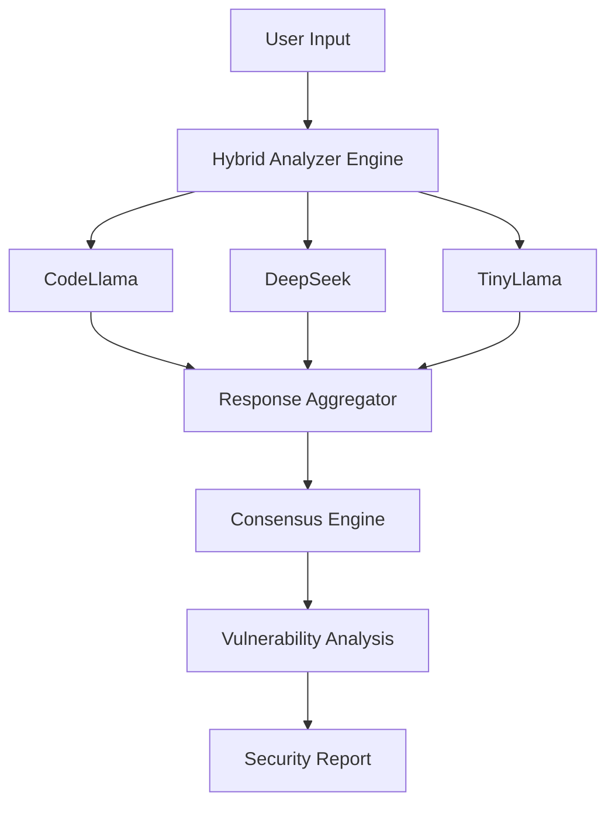

# 🚀 HybridGuard — Multi-LLM AI Cybersecurity Analysis Engine

<div align="center">


<p align="center">
  
</p>

<p align="center">
  
  
  
  
  
</p>

</div>

---

# ⚡ Overview

**HybridGuard** is a next-generation AI-powered cybersecurity analysis platform that combines multiple Large Language Models (LLMs) into a unified hybrid inference architecture for intelligent vulnerability detection, code analysis, and security assessment.

Unlike traditional single-model systems, HybridGuard orchestrates multiple specialized AI models together to improve:
- Detection accuracy
- Context understanding
- Threat reasoning
- Vulnerability classification
- Security insight generation

The system leverages:
- 🧠 Ensemble AI reasoning
- 🔄 Sequential model orchestration
- ⚡ Local LLM execution via Ollama
- 🔍 Intelligent vulnerability analysis
- 📊 Multi-model response aggregation

---

# 🧠 Core Architecture



---

# 🔥 Key Features

## 🛡 Multi-LLM Security Intelligence
HybridGuard combines multiple AI models to improve cybersecurity analysis reliability and reduce single-model hallucinations.

---

## ⚡ Sequential Hybrid Inference
Models are intelligently orchestrated in sequence for:
- Context refinement
- Multi-stage reasoning
- Enhanced vulnerability detection

---

## 🧠 Consensus-Based Decision System
The platform aggregates responses across models using:
- Voting mechanisms
- Consensus analysis
- Confidence comparison

---

## 🔍 Vulnerability Detection
HybridGuard can analyze:
- Source code
- Security logic
- Potential attack vectors
- Weak implementations
- Misconfigurations

---

## 🚀 Local AI Execution
Runs local LLMs using:
- Ollama
- Lightweight deployment
- Offline inference capabilities

---

## 📊 Intelligent Logging & Monitoring
Includes:
- API monitoring
- Token handling
- Request tracking
- Error analysis
- Model health validation

---

# 🧩 Tech Stack

| Technology | Purpose |
|---|---|
| Python | Core Backend |
| Flask | API Layer |
| Ollama | Local LLM Runtime |
| CodeLlama | Code Analysis |
| DeepSeek | Security Reasoning |
| TinyLlama | Lightweight Inference |
| REST APIs | Communication |
| JSON | Data Exchange |

---

# 📂 Project Structure

```bash
HybridGuard/
│
├── backend/
├── models/
├── analyzers/
├── routes/
├── utils/
├── logs/
├── static/
├── templates/
├── requirements.txt
├── app.py
├── controller.py
└── README.md
```

---

# ⚙️ Installation

## 1️⃣ Clone Repository

```bash
git clone git@github.com:saki1205/HybridGuard.git
cd HybridGuard
```

---

## 2️⃣ Create Virtual Environment

```bash
python -m venv venv
```

### Activate

#### Windows
```bash
venv\Scripts\activate
```

#### Linux / Mac
```bash
source venv/bin/activate
```

---

## 3️⃣ Install Dependencies

```bash
pip install -r requirements.txt
```

---

## 4️⃣ Install Ollama

[Ollama Official Website](https://ollama.com/)

Pull required models:

```bash
ollama pull codellama
ollama pull deepseek
ollama pull tinyllama
```

---

# ▶️ Run HybridGuard

```bash
python app.py
```

---

# 🌐 API Endpoints

| Method | Endpoint | Description |
|---|---|---|
| GET | `/api/health` | System Health |
| POST | `/api/analyze` | Vulnerability Analysis |
| GET | `/api/models` | Model Status |
| POST | `/api/scan` | Security Scan |

---

# 📈 Future Enhancements

- ✅ GPU acceleration
- ✅ Advanced ensemble scoring
- ✅ Real-time threat intelligence
- ✅ Docker deployment
- ✅ Kubernetes scaling
- ✅ Web dashboard
- ✅ CVE integration
- ✅ AI-powered remediation suggestions
- ✅ RAG-based security memory
- ✅ Autonomous security workflows

---

# 🖥 Example Workflow

```text
Input Source Code
        ↓
Hybrid Analyzer
        ↓
Multi-LLM Processing
        ↓
Consensus Evaluation
        ↓
Threat Detection
        ↓
Security Report Generation
```

---

# 🧪 Example Use Cases

- Secure code review
- AI-powered vulnerability scanning
- Cybersecurity education
- Threat analysis
- Security auditing
- Automated risk assessment

---

# 📸 Preview

> Add screenshots, terminal demos, architecture images, or API responses here.

---

# 🤝 Contributing

Contributions are welcome.

```bash
Fork → Improve → Commit → Pull Request
```

---

# 👨‍💻 Author

## Saketh Mothe

AI Developer • Cybersecurity Enthusiast • Full Stack Developer

- Multi-LLM Systems
- AI Security Research
- Flask & Backend Engineering
- Hybrid AI Architectures

---

# ⭐ Support

If you found this project useful:

⭐ Star the repository  
🍴 Fork the project  
🧠 Contribute improvements

---

<div align="center">

# ⚔️ HybridGuard

### *Defending Systems with Hybrid AI Intelligence*


</div>
